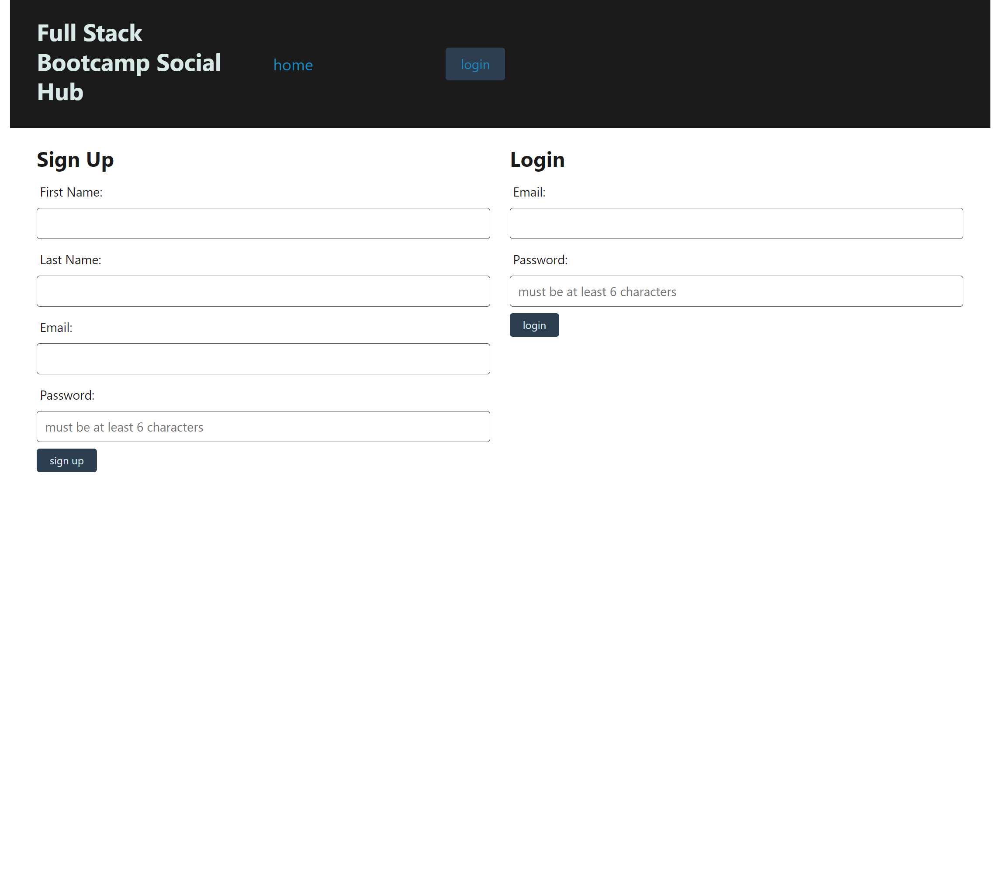

# Full Stack Bootcamp Social Hub

## Table of Contents

---

- [Description](#description)
- [Installation](#installation)
- [Tests](#tests)
- [Usage](#usage)
- [License](#license)
- [Contributing](#contributing)
- [Credits](#credits)

## Description

A social media platform to talk about the day's class and intereact with other students posts via comments and likes. 

## Installation

Run "npm i" to install all of the packages required to work with the project. then run "node start" to run a script to start the server, or run node server.js

## Technologies Utilized

- Node
- CSS
- JASS
- Handlebars.JS 
- Javascript
- Express
- Sequelize
- Node-automated Email Sender

## Features

- login with email and password
- make a post
- filter by tags
- get autimated email when you sign up
- view other people's posts 
- login to make a post, see comments, and like posts
- update your profile
- view your posts on your profile
- like and unlike posts via profile
 
## Tests

N/A

## Usage

 This site is uploaded to heroku. On heroku, you can log in/sign up, view your own posts, update your profile info, view others posts, comment and like others posts, and filter posts by tags. 

## License

- [License](#license)

## License

This project is licensed under the MIT license. Click [here](https://choosealicense.com/licenses/mit/) for more information.

## Contributing

 - Fork the repository.
 - Create a new branch.
 - Make your changes and commit them.
 - Push to the branch.
 - Submit a pull request.

## Credits

- Jacob Nelson-Stone
- Sean Hayes
- Jamie Glarner
- Mohamed Mohamed

## GitHub

- JacobDNelsonStone
- hayessea000
- jglarner3
- MohamedH77

## Webpage

https://discussion-board-hayessea000.herokuapp.com/

---

Last updated: May 16, 2023
